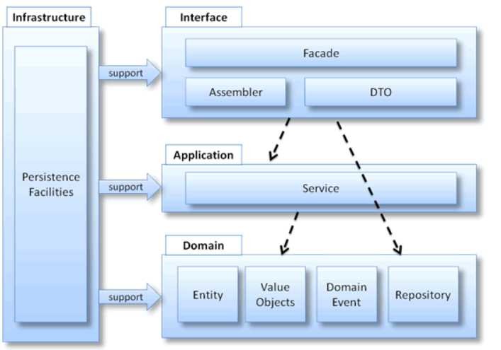
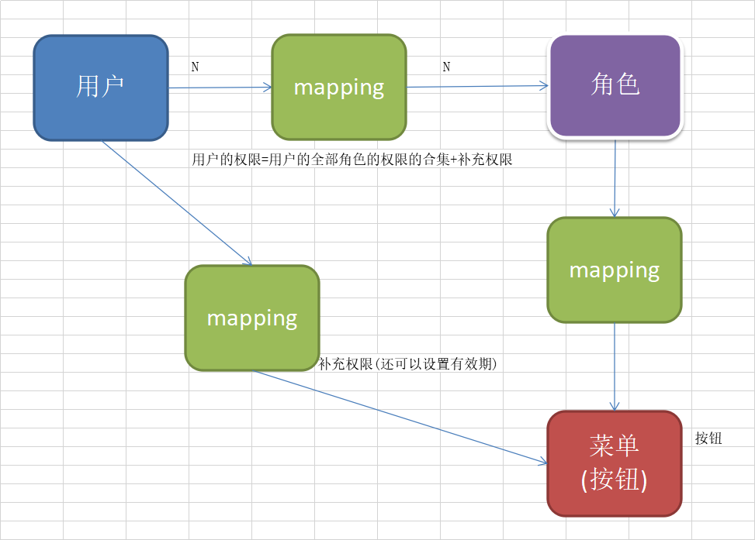
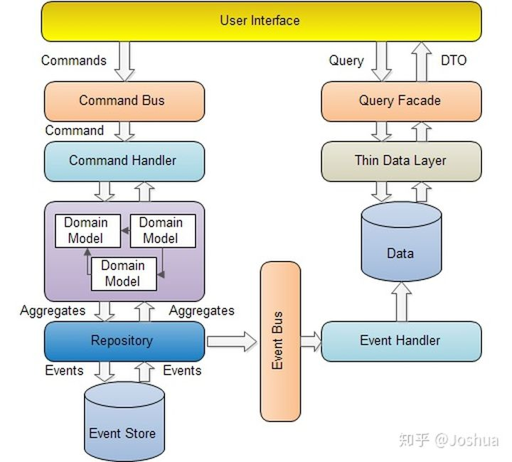
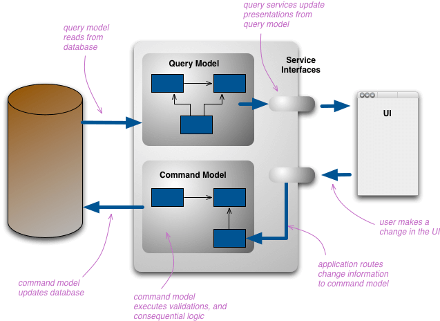

### 前言

- POP(procedure oriented programming)

  - 线性的思维解决问题，分析出解决问题所需要的步骤，并且在这个过程中考虑分层，模块化等具体的组织方式，分解软件的复杂度，然后用函数把这些步骤一步一步实现，使用的时候再一个一个的依次调用。当软件的复杂度不是很大，POP能得到很好的效果。
- OOP(object oriented programming)
  - 把事务分解成为一个个对象，然后由对象之间分工与合作。建立对象的目的不是为了完成一个步骤，而是为了描叙某个事物在整个解决方案中的行为。OOP的初衷就是一种处理软件复杂度的设计方法。

- 面向过程是自顶向下的编程，符合常规思维，没有面向对象易维护、易复用、易扩展的特点，但性能比面向对象高，因为类调用时需要实例化，开销比较大，比较消耗资源；面向对象则是实物高度抽象化，由于面向对象有封装，继承，多态的特性，可以设计出低耦合的系统，使系统更加灵活，更加易维护，易复用、易扩展，但性能比面向过程低。
- AOP(aspect oriented programming)：既不修改类，又能扩展类的功能，可以在不破坏封装的前提下，解决OOP扩展的问题
  1. 聚焦业务逻辑，跟公共逻辑拆分
  2. 代码复用，集中管理，保证质量
  3. 任意扩展公共逻辑
- POP是无边界的，软件复杂度小适用，例如盖房子，从墙、房顶、门窗一条龙
- OOP的边界是对象，软件复杂度中适用，例如盖大厦，每间房子的样式就是一个对象，然后多个对象之间组合成整栋楼。
- 但如果想建一座城市，城市中有大厦、学校、公园、工厂等等，此时属于软件复杂度较高的场景，面向对象就不适用了。这时就需要另外一个更大维度的东西作为新的边界。

### DDD(domain driven design)

- https://tech.meituan.com/2017/12/22/ddd-in-practice.html

- POP、OOP是编程思想，DDD是系统分析设计方法
- DDD用来解决系统规模日益变大的问题。将系统根据业务逻辑，拆分成不同的领域(domain)，整个系统中领域是核心
- driven：基于领域驱动领域设计，以目标为导向，为领域做设计；基于领域驱动代码实现，核心关注点都是领域；design：比如开发一个博客，ddd思想是领域是核心，先分析领域，比如用户登录注册、发帖回帖、积分等等，然后做代码设计/数据库设计，而传统开发先分析设计数据库，然后做页面和数据访问，就导致容易需求变更，其实是需求分析不够，而且开发和需求语言不通
- 系统开发完作用域之后，会有一个统一的语言：需求-设计-开发用同一种语言

- 领域划分没有一定之规，千人千面

- 如何落地？

  

1. user interface：用户展示相关。DTO：典型的贫血模型(没有逻辑)，为了完成交互，专门为UI服务

2. application：应用服务层，很薄的一层，完成对domain的调用，完成请求转发，为user interface服务，为什么存在？因为有的时候会存在跨领域问题，一个领域完成不了，这里不包含任何的领域逻辑

3. domain：系统核心，将一个大的需求不断拆分，最终的小个体就是domain，体系架构都是基于领域驱动的，程序设计时，就是为了领域而设计，领域一旦确认了，就会驱动代码实现，domain内容包括业务和数据

4. infrastructure layer：比如util或者common，数据操作，数据存储，常用帮助类

   

   如上，用户、菜单、角色就是不同的领域，三个领域之间的映射就靠application来完成跨领域

5. 传统设计中一个用户、菜单、角色就是一张表，一个类，是天然的划分，边界。领域划分时可以将用户、角色、菜单当成一个领域，对外来说，不允许直接调用菜单或者用户或者角色，别人必须通过领域来调用，这在代码中表现为聚合根aggregateroot

6. 实体entity不是数据库实体，而是既包含数据库又包含行为(增删改查)的实体，多个实体组成聚合根

7. 工厂：存在的原因：领域/实体太复杂了

8. 仓储：管理数据操作

- 最佳实践：
  - https://insights.thoughtworks.cn/backend-development-ddd/
  - https://tech.meituan.com/2017/12/22/ddd-in-practice.html

  - https://github.com/Air433/dddbook

- DDD把领域模型的重要性提高到了数据模型之上，在传统的MVC分层架构下。我们将项目结构分为Controller，Service，DAO 这三个主要的层，所有的业务逻辑都在Service中体现，而我们的实体类Entity却只是充当一个与数据库做ORM映射的数据容器而已，它并没有反映出模型的业务价值。所以又把这种模型称为“贫血模型”。“贫血模型”有什么坏处呢？在我们的代码 中将会到处看到各种的setter方法和各种各样的参数校验的代码，尤其是在Service层，但是这些代码它并没有反映出它的业务价值。这就是事务脚本的架构下，所呈现出来的弊端，这种模式下认为数据模型优先，所以会导致开发人员和产品经理在讨论问题的时候，完全是从两个角度在思考问题。开发人员听到需求后，脑袋里想的并不是如何反应出业务的价值，而是考虑的是数据库表怎么设计，字段该怎么加这些问题。所以DDD中提出了通用语言这么一个概念，并且基本将通用语言的概念贯穿于整个落地的过程。这样会大大的减少成员之间的沟通成本（前提是大家都从心里接受了DDD）。

#### CRUD

- 分别指增加(create)，读取查询(retrieve)，更新(update)，删除(delete)

#### CQRS

- 在日益复杂的软件系统中，有时我们希望从不同的维度查询数据，或者需要将各种数据进行组合后返回给调用方。此时，将查询逻辑与业务逻辑糅合在一起会使软件迅速腐化，诸如逻辑混乱、可读性变差以及可扩展性降低等等一些列问题。

  设想电商系统中的订单（Order）对象，一开始其对应的OrderRepository类可以简单到只包含2个方法：

  ```java
  public interface OrderRepository {
      void save(Order order);
      Order byId(String id);
  }
  ```

  在项目的演进中，你可能需要依次实现以下需求：

  1. 查询某个Order详情，详情中不用包含Order的某些字段；
  2. 查询Order列表，列表中所展示的数据比Order详情更少；
  3. 根据时间、类别和金额等多种筛选条件查询Order列表；
  4. 展示Order中的产品（Product）概要信息，而Product属于另一个业务实体；
  5. 展示Order下单人的昵称，下单人信息属于另一个单独的账户系统，用户修改昵称之后，Order下单人昵称也需要相应更新；
  6. ……

  当这些需求实现完后，你可能会发现OrderRepository和领域模型已经被各种“查询”功能淹没了。什么？OrderRepository不是给领域模型提供Order聚合根对象的吗，为什么却充斥着如此多的查询逻辑？

  此时，就需要用到CQRS模式了。

- CQRS (Command Query Responsibility Segregation)，故名思义是将command与query分离的一种模式。query很好理解，就是查询，那么command又是什么呢？

  CQRS将系统中的操作分为两类，即命令(Command) 与查询(Query)。命令则是对会引起数据发生变化操作的总称，即我们常说的新增，更新，删除这些操作，都是命令。而查询则和字面意思一样，即不会对数据产生变化的操作，只是按照某些条件查找数据。

  CQRS 的核心思想是**将这两类不同的操作进行分离，然后在两个独立的服务中实现。这里的服务一般是指两个独立部署的应用。在某些特殊情况下，也可以部署在同一个应用内的不同接口上。command 与 Query 对应的数据源也应该是互相独立的，即更新操作在一个数据源，而查询操作在另一个数据源上**。

  

- CQRS通过单独的读模型解决上述问题，其大致的架构图如下：

  

- CQRS 在 DDD 中是一种常常被提及的模式，它的用途在于将领域模型与查询功能进行分离，让一些复杂的查询摆脱领域模型的限制，以更为简单的 DTO 形式展现查询结果。同时分离了不同的数据存储结构，让开发者按照查询的功能与要求更加自由的选择数据存储引擎。

  同样的，CQRS 在带来架构自由与便利的同时也不可避免的引入了额外的复杂性与技能要求，例如对于分布式事务，消息中间件的管理，数据模型的设计等等。

- [CQRS实践参考](https://insights.thoughtworks.cn/backend-development-cqrs/)


